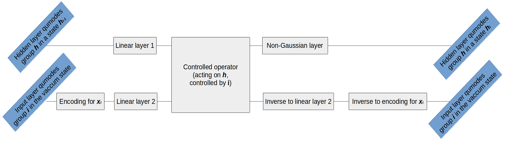

# quantum-CV-RNN
Quantum Continuous-Variable Recurrent Neural Network model for PennyLane QML framework

## Architecture description

Please read [a guide](https://strawberryfields.ai/photonics/demos/run_quantum_neural_network.html)
about quantum neural network on strawberryfields first.

To create an analog of Elman RNN we need to have followng building blocks:

- Data encoding procedure: Displacement encoding is used.

- Quantum linear layer: Can be created from the quantum layer from the guide without
non-Gaussian activation gates at the end.

- Inverse to quantum linear layer operator to reset a group of qumodes to the vacuum state after each step.
Because all quantum operators

- Unitary operator acting on a one group of qumodes while beeing controlled by another group of qumode:
A sequence of controlled phase operations is used to transfer information from between groups of qumodes.

- Activation function: It is just a layer of non-Gaussian gates. 

On a picture bellow you can see a block of the proposed quantum continuous-variable RNN
acting on some input sequence at time *t*.

After performing Quantum CV RNN classification on the hidden qumodes state can be performed.
